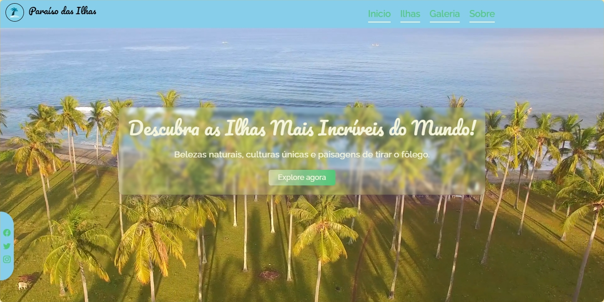
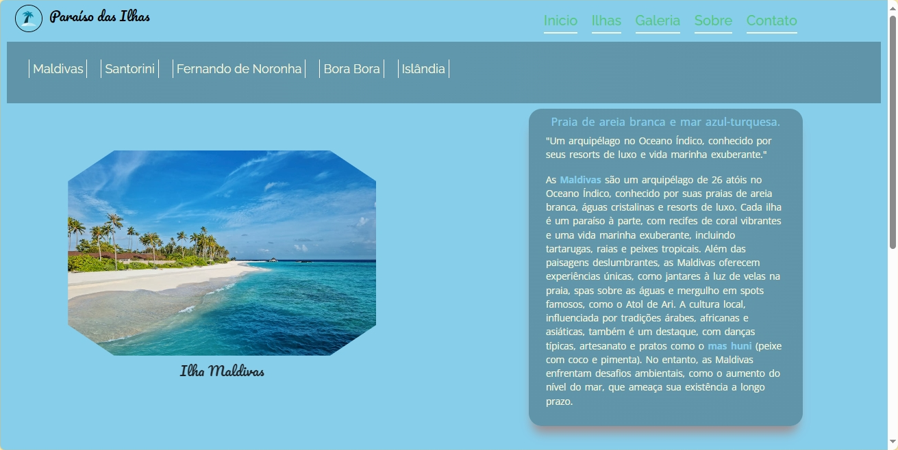
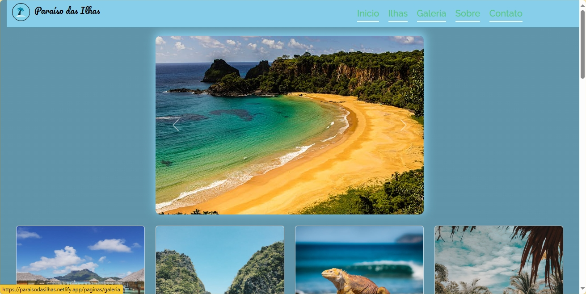
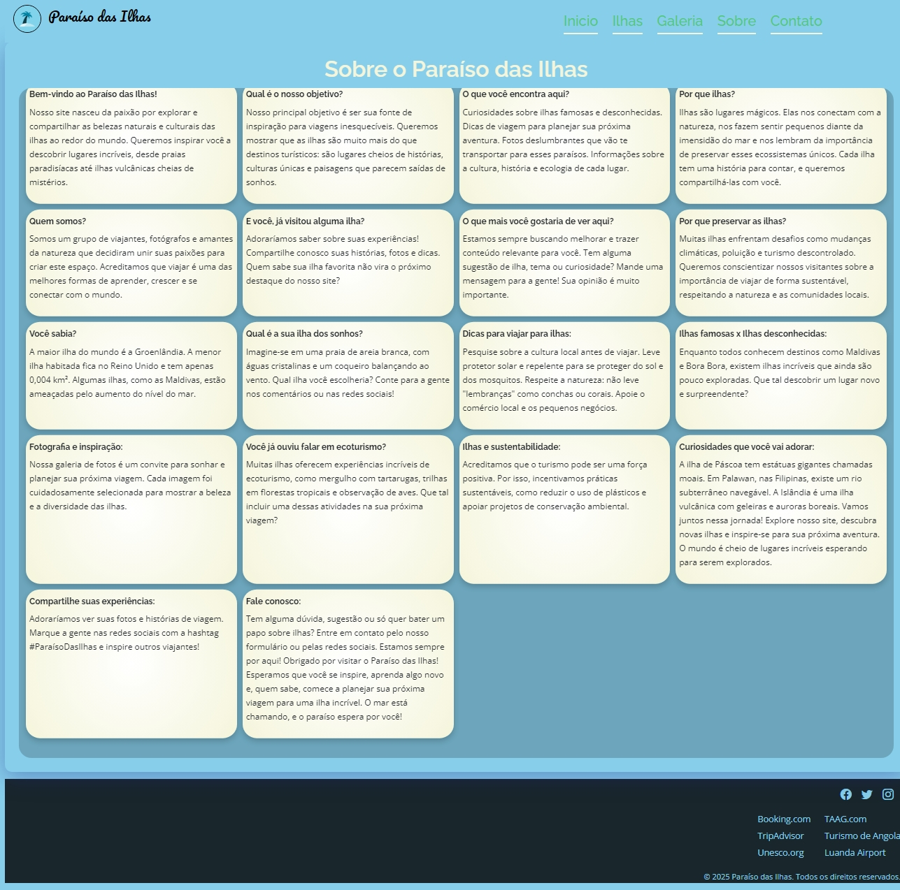

# "Paraíso das Ilhas"
Explore as ilhas mais incríveis do mundo! Nosso site é um convite para descobrir destinos paradisíacos, com informações detalhadas sobre praias deslumbrantes, culturas fascinantes e paisagens de tirar o fôlego. De ilhas tropicais como as Maldivas e Bora Bora a lugares exóticos como a Islândia e Fernando de Noronha, inspire-se para sua próxima aventura. Aqui, você encontra curiosidades, dicas de viagem, fotos deslumbrantes e muito mais. Viva a magia das ilhas conosco e comece a planejar seu sonho hoje mesmo!

# Como usar ?
Basta acessar o site: [Paraíso das Ilhas](https://paraisodasilhas.netlify.app/)

## Tecnologias:
- Linguagens: HTML5, CSS3, JavaScript, Meu Cérebro
- Ferramentas: VSCode, Git

